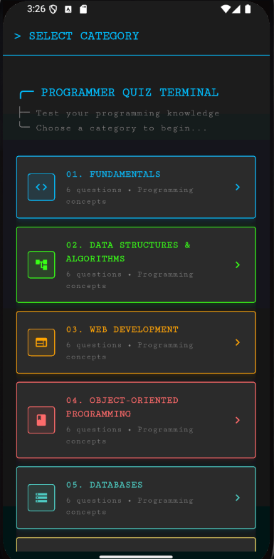
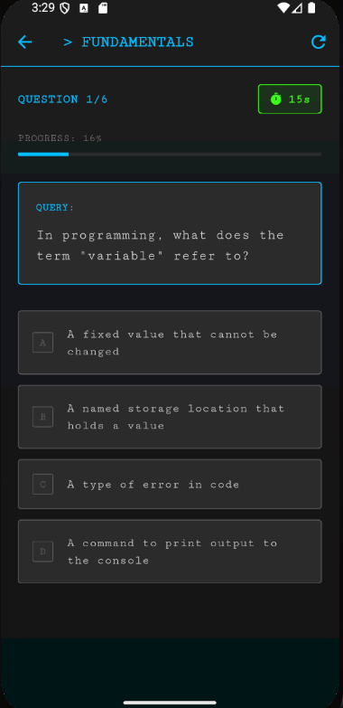

# 🧑‍💻 Programmer Quiz Terminal

A terminal-style, animated multiple-choice Quiz App built with Flutter, featuring 8 programming categories. Test your knowledge with a sleek dark theme, timed questions, and smooth animations — all in a single `main.dart` file.

## 🚀 Features

✅ Choose from 8 programming categories (Fundamentals, Web Dev, OOP, etc.)

🧠 6 randomly shuffled questions per quiz category

⏱ Countdown timer per question (20 seconds)

✅ Immediate visual feedback on answer selection (correct/incorrect)

📊 Final score, accuracy percentage, and performance grade

🎨 Animated transitions, progress bar, and terminal-themed UI

🧾 Entire app in a single `main.dart` file

## 🖼 Screenshots

 


## 📁 File Structure

```bash
📂 programmer_quiz_terminal/
  └── lib/
      └── main.dart
```

## 🛠 Getting Started
Prerequisites
    Flutter SDK installed
    A working emulator or physical device
## Run the App
    flutter pub get
    flutter run


## 📦 Dependencies
This app uses only core Flutter libraries:
    . material.dart
    . dart:math
    . dart:async
    . No external packages required.

## ✨ Customization
Want to expand the quiz?

    Add more questions: Include new Question objects in the _allQuestions list within main.dart.
    Add new categories: Add the category name to CategoryPage.categories, define its icon/color in CategoryPage._categoryData, and ensure new questions use the exact category name.
    Adjust difficulty/time: Modify the timeLeft initial value or question selection logic.
    Enhance persistence: Integrate shared_preferences or a local database to track high scores.

## 🧑‍💻 Author
Built as a Flutter project – feel free to customize and expand!

## 📄 License
This project is open-source and available under the MIT License.